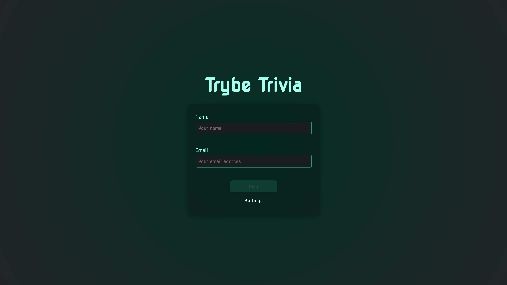

# Trivia Game - Trybe

This is a solution to [Trybe's](https://www.betrybe.com/) Trivia Game Project. Trybe is a web development school that has a genuine commitment to the professional success of its students. 

## Table of contents

- [Trivia Game - Trybe](#trivia-game---trybe)
  - [Table of contents](#table-of-contents)
  - [Overview](#overview)
    - [The challenge](#the-challenge)
    - [Screenshot](#screenshot)
    - [Links](#links)
    - [Built with](#built-with)
  - [Authors](#authors)

## Overview

This was a group project in which we developed a trivia-based quiz game using React and Redux, developing its functionality in groups according to the demands defined in a Kanban board.

### The challenge

Users should be able to:

- Log into the game and, if the email is registered on Gravatar's website, have their photo associated with the user profile.
- Access the game's page, where you must choose one of the available answers for each of the questions presented. The answer must be marked before the time counter reaches zero, otherwise the answer will be considered wrong.
- Be redirected, after X questions have been answered, to the score screen, where the text shown depends on the number of right answers.
- View the ranking page, if you like, at the end of each game.
- Configure some options for the game in a configuration screen accessible from the app header.

### Screenshot

.png)

### Links

- Live Site URL: [Trivia Game App](https://trivia-game-drab.vercel.app/)

### Built with

- Flexbox
- Mobile-first workflow
- [React](https://reactjs.org/) - JS library
- [Redux](https://redux.js.org/) - JS library

## Authors

- [Pedro Guarize](https://www.linkedin.com/in/pedroguarize/)
- [Adadezer Iwazaki](https://www.linkedin.com/in/adadezer-iwazaki-1078b021a/)
- [André Bonafé](https://www.linkedin.com/in/andre-bonafe/)
- [Rafael Friederick](https://www.linkedin.com/in/rafaelmfriederick/)
